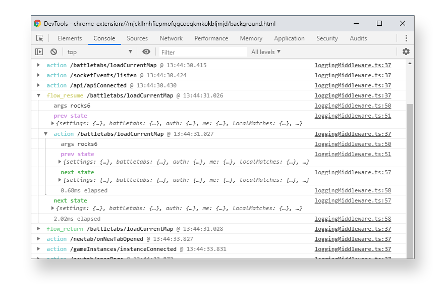

<a href="docs/images/screenshot01.png"></a>

# MST Log

A console logging middleware for MobX State Tree

## Install

`yarn add mst-log`

## Usage

```typescript
import { addMiddleware, types } from "mobx-state-tree";
import { mstLog } from "mst-log";

// Create your store
const myStore = types.model({}).create({});

// Attach the middleware
addMiddleware(myStore, mstLog());
```

## Options

There are a few options you can provide to control how logging works:

```typescript
type Options = {
  getCallTypeColor: (type: IMiddlewareEventType) => string;
  getShouldGroupBeCollapsed: (call: IMiddlewareEvent) => boolean;
  logger: Logger;
  getTime: () => number;
};
```

If theres some aspect you would like to be able to change please do open a PR :)

## Thanks

Thanks go to the [redux-logger](https://github.com/LogRocket/redux-logger) library for the inspiration in this one.

## Contributors ✨

Thanks goes to these wonderful people ([emoji key](https://allcontributors.org/docs/en/emoji-key)):

<!-- ALL-CONTRIBUTORS-LIST:START - Do not remove or modify this section -->
<!-- prettier-ignore-start -->
<!-- markdownlint-disable -->
<table>
  <tr>
    <td align="center"><a href="http://www.mikecann.co.uk"><br /><sub><b>Mike Cann</b></sub></a><br /><a href="https://github.com/mikecann/mst-flow-pipe/commits?author=mikecann" title="Code">💻</a></td>
  </tr>
</table>

<!-- markdownlint-enable -->
<!-- prettier-ignore-end -->

<!-- ALL-CONTRIBUTORS-LIST:END -->

This project follows the [all-contributors](https://github.com/all-contributors/all-contributors) specification. Contributions of any kind welcome!
